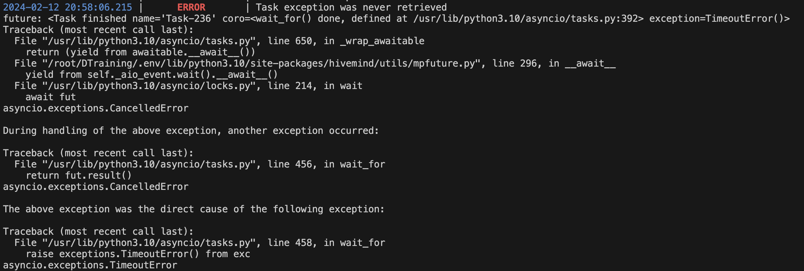
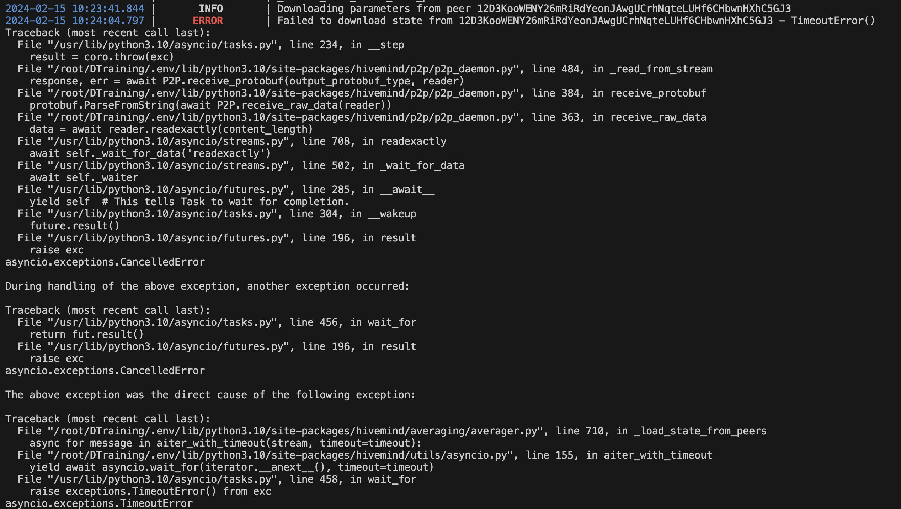
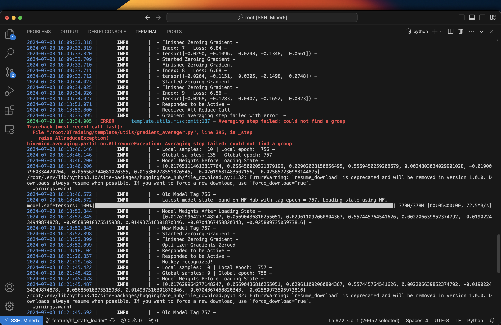
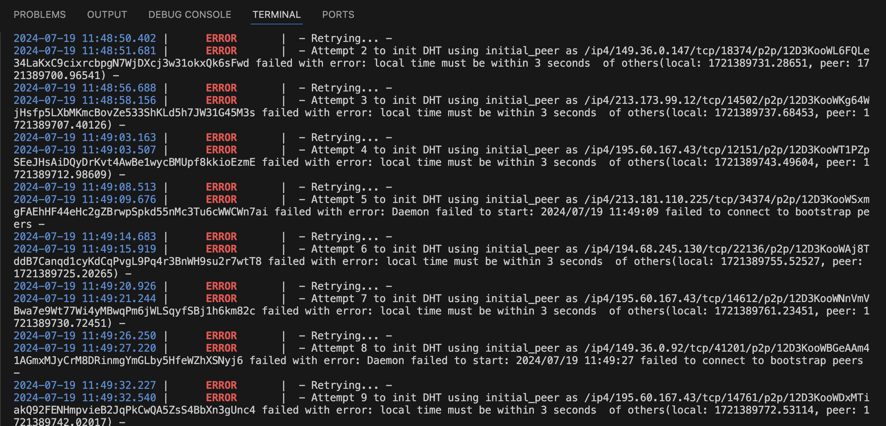

<div align="center">

# **Distributed Training Subnet** <!-- omit in toc -->
[](https://discord.gg/bittensor)
[](https://opensource.org/licenses/MIT) 

</div>

---

# Overview
[Blog post](https://distributed-training.notion.site/Decentralised-Distributed-Training-fd21bdfa72294dfeab8fb092770212b9)

# Minimum Requirements

[min.compute.yml](min.compute.yml)

# Installation
This repository requires python3.10 or higher. To install, simply clone this repository and install the requirements.

1. Install this repository
```bash
git clone https://github.com/KMFODA/DistributedTraining
cd DistributedTraining
pip install -e .
```

2. Log in to wandb:
```bash
wandb login <your_wandb_api_key>
```

3. Install [PM2](https://pm2.io/docs/runtime/guide/installation/) and the [`jq` package](https://jqlang.github.io/jq/) on your system.

**On Linux**:
```bash
sudo apt update && sudo apt install jq && sudo apt install npm && sudo npm install pm2 -g && pm2 update
``` 
**On Mac OS**
```bash
brew update && brew install jq && brew install npm && sudo npm install pm2 -g && pm2 update
```

4. Register your hotkey
```bash
btcli subnets register --subtensor.network finney --netuid $NETUID --wallet.name $WALLET_NAME --wallet.hotkey $HOTKEY_NAME
```

5. Copy the .env file to your root directory
```bash
cp DistributedTraining/.env /root/
```

6. Uninstall nest_asyncio as it isn't compatible with hivemind
```bash
python DistributedTraining/post_install.py
```


---
# Running a Miner
Once you have installed this repo you can run a miner with **auto updates enabled** using the following commands.
```bash
chmod +x run_miner.sh
pm2 start run_miner.sh --name distributed_training_miner_auto_update --
    --netuid <your netuid>  # Must be attained by following the instructions in the docs/running_on_*.md files
    --subtensor.chain_endpoint <your chain url>  # Must be attained by following the instructions in the docs/running_on_*.md files
    --wallet.name <your miner wallet> # Must be created using the bittensor-cli
    --wallet.hotkey <your validator hotkey> # Must be created using the bittensor-cli
    --logging.debug # Run in debug mode, alternatively --logging.trace for trace mode
    --axon.port <an open port to serve the bt axon on>
    --dht.port <another open port to serve the dht axon on>
    --dht.ip <your device ip address>
```
---

# Running a Validator
Once you have installed this repo you should request access to the Distributed org on HF using the following [link](https://huggingface.co/login?next=%2Fdistributed). You can then run a validator **auto updates enabled** using the following command.
```bash
chmod +x run_validator.sh
pm2 start run_validator.sh --name distributed_training_auto_update --
    --netuid <your netuid> # Must be attained by following the instructions in the docs/running_on_*.md files
    --subtensor.chain_endpoint <your chain url> # Must be attained by following the instructions in the docs/running_on_*.md files
    --wallet.name <your validator wallet>  # Must be created using the bittensor-cli
    --wallet.hotkey <your validator hotkey> # Must be created using the bittensor-cli
    --logging.debug # Run in debug mode, alternatively --logging.trace for trace mode
    --axon.port <an open port to serve the bt axon on>
    --dht.port <another open port to serve the dht axon on>
    --dht.ip <your device ip address>
```

</div>

---

## Known Errors
Currently this subnet still relies on the awesome [hivemind](https://github.com/learning-at-home/hivemind) library to facilitate the all-reduce part of distributed training. This library runs multiple asynchronous porcesses in the background and sometimes these fail. It is desinged in a way such that if some of these failures occur training still progresses. Here are some of the most common errors.

**Asyncio Timeout Error**:


This happens when one of the various async processes times out. If your logs continue after this error and you still receive validator calls your miner will still gain incentive.

**Load State From Peer Error**:


This happens when a validator tries to pull the latest model state frorm another peer and fails to do so in the timeout period. This is most likely due to low bandwidth on either your or your peers side. So long as your bandwidth on WandB is above the minimum requirements this won't impact your incentive.

**Averaging step failed: could not find a group**:


This occurs when your miner hasn't been able to find a group to join to perform the all-reduce round. This might be due to low bandwidth or issues with your DHT connecting with other DHTs. Make sure your bandwidth is above the minimum requirements and that you aren't running any other background processes or miners on the same machine. Getting this error once shouldn't have a huge impact on incentive but if it keeps repeating incentives will drop.

**Failed to connect to DHT address**:


This error indicates that you are failing to connect to some of the DHT addresses in the initial_peers list. This isn't a breaking error if you just have 1 successful attempt at the end of these retries. Many retries are expected as nodes drop out of training and leave their DHT's idle in the background.

## License
This repository is licensed under the MIT License.
```text
# The MIT License (MIT)
# Copyright © 2023 Yuma Rao

# Permission is hereby granted, free of charge, to any person obtaining a copy of this software and associated
# documentation files (the “Software”), to deal in the Software without restriction, including without limitation
# the rights to use, copy, modify, merge, publish, distribute, sublicense, and/or sell copies of the Software,
# and to permit persons to whom the Software is furnished to do so, subject to the following conditions:

# The above copyright notice and this permission notice shall be included in all copies or substantial portions of
# the Software.

# THE SOFTWARE IS PROVIDED “AS IS”, WITHOUT WARRANTY OF ANY KIND, EXPRESS OR IMPLIED, INCLUDING BUT NOT LIMITED TO
# THE WARRANTIES OF MERCHANTABILITY, FITNESS FOR A PARTICULAR PURPOSE AND NONINFRINGEMENT. IN NO EVENT SHALL
# THE AUTHORS OR COPYRIGHT HOLDERS BE LIABLE FOR ANY CLAIM, DAMAGES OR OTHER LIABILITY, WHETHER IN AN ACTION
# OF CONTRACT, TORT OR OTHERWISE, ARISING FROM, OUT OF OR IN CONNECTION WITH THE SOFTWARE OR THE USE OR OTHER
# DEALINGS IN THE SOFTWARE.
```
